# AgeWell Website

The site can be accessed by this [link](https://peteig.github.io/AgeWell/)

## Introduction
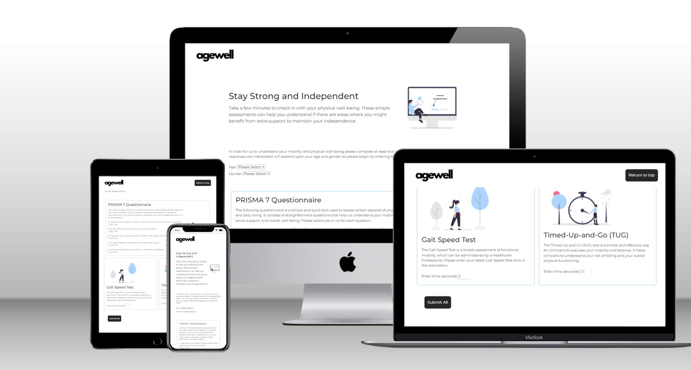

## Usage

Navigate through the website to perform self-assessments for frailty risk. The site provides three validated assessments: the PRISMA 7 Questionnaire, the Gait Speed Test, and the Timed Up and Go (TUG) Test. Complete at least two of these assessments to receive an overall risk evaluation

## Contact
LinkedIn: https://www.linkedin.com/in/peter-bishop-ab083546

---

### Project Goals
The goal of this prototype is to provide a proof of concept for a resource that helps ageing adults self-assess their frailty risk. This tool aims to inform users if a risk is identified. It demonstrates the potential for incorporating such assessments into a broader health monitoring application.

### User Goals
The site targets ageing adults and healthcare professionals. User goals are:

- To assess frailty risk using validated tools
- To receive a clear and concise risk stratification
- To understand which areas of physical well-being may need extra support
- To easily navigate and use the assessment tools

The site effectively meets these goals because:
- It offers three validated assessments: PRISMA 7 Questionnaire, Gait Speed Test, and TUG Test
- It provides an overall risk stratification based on the assessments completed
- It is user-friendly with clear instructions for each assessment
- The design is responsive and easy to navigate

## User Stories
1. As an ageing adult, I want to assess my frailty risk, so that I can take proactive steps to maintain my independence.
2. As a healthcare professional, I want to understand the frailty risk of my patients quickly, so that I can provide appropriate support and resources.
3. As a caregiver, I want to know if my loved one is at risk of frailty, so that I can ensure they get the help they need.

---

## Features
### Navbar

#### Navigation

- Positioned at the top of the page.
- Contains the site logo on the left side.
- The site is a single page because the user flow does not require additional pages.
- Contains a button on the right-hand side to scroll back to the top which only appears once the user is a certain way down the page. 

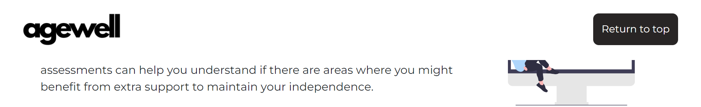

#### Homepage
1. Hero Section which provides:
- An introduction to the frailty risk assessment tool.
- Brief instructions on how to use the tool.
- A call-to-action to start the assessments.

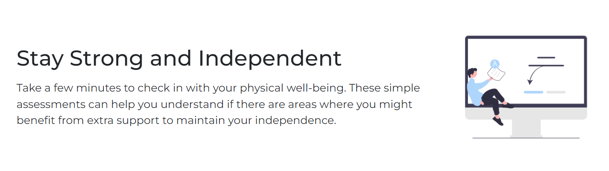

2. Introduction Section
This section features a welcoming message and a brief introduction to the tool.
It includes:
- An overview of the purpose of the assessments.
- A direct link to start the assessments.

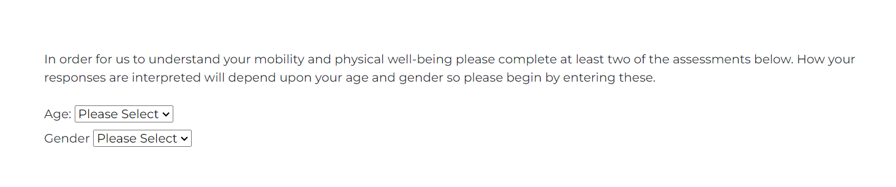

3. Assessments Section
This section allows users to complete the PRISMA 7 Questionnaire, the Gait Speed Test, and the TUG Test.
It offers:
- Clear instructions for each assessment.
- Input fields for users to enter their results.
- A submission button to calculate the overall risk.

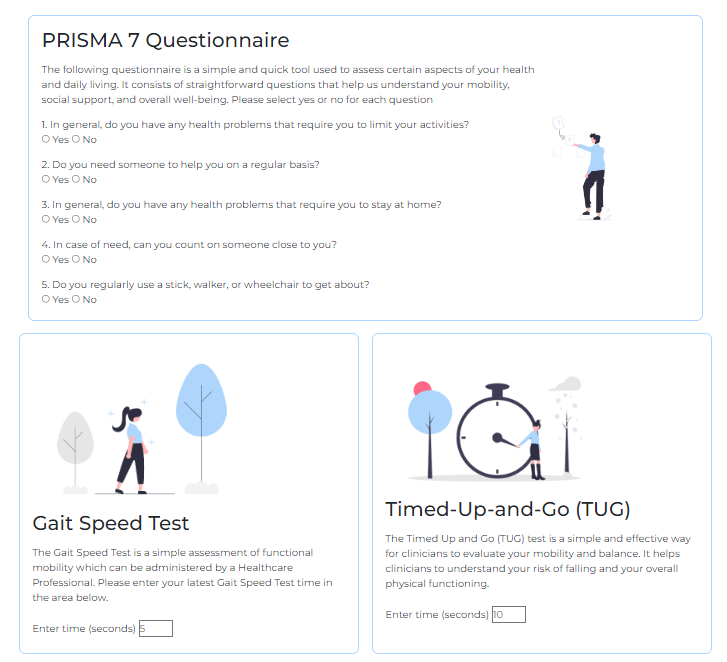

4. Results Page
- Displays the overall frailty risk result based on the assessments completed.
- Provides a clear risk stratification message.

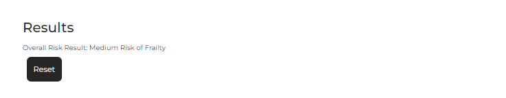

5. Alert Modal
- Displays an alert modal advising the user if they have attempted to submit their responses without meeting the minimum criteria to provide them with results.

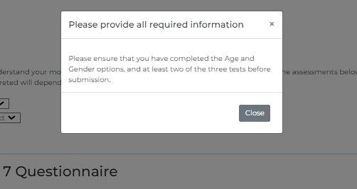

---

### Technologies Utilised
- [HTML](https://developer.mozilla.org/en-US/docs/Web/HTML): Served as the fundamental building block for the site's structure.
- [CSS](https://developer.mozilla.org/en-US/docs/Web/CSS): Employed for styling and designing the site's layout.
- [JavaScript](https://developer.mozilla.org/en-US/docs/Web/JavaScript): For interactive features and form validations.
- [Bootstrap](https://getbootstrap.com/): Enabled fast, responsive design with a suite of ready-to-use components and utilities for layout and styling.
- [CSS Flexbox](https://developer.mozilla.org/en-US/docs/Learn/CSS/CSS_layout/Flexbox): Utilised for symmetrically organising elements across various pages.
- [Moqups](https://moqups.com/): Leveraged for creating initial wireframes of the website.
- [Gitpod](https://gitpod.io/): Chosen as the primary coding and editing environment.
- [Git](https://git-scm.com/): Utilized for version control management of the website's codebase.
- [GitHub](https://github.com/): Hosted the repository for storing and sharing the website's code.
- [Canva](https://www.canva.com/): Used to create a simple mock logo for the AgeWell website.

---

### Design
#### Color Scheme
##### Colour Palette

The primary colour palette comprises shades that align with the professional and clinical focus of the tool.
Blue and grey tones are used to create a clean and calming aesthetic, enhancing readability and user experience.

#### Typography

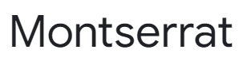

A modern sans-serif font is used for its clarity and professionalism, ensuring the content is easy to read.

##### Design Rationale
- The design is user-centric, ensuring the assessments are easy to navigate and complete.
- The colour scheme and typography reflect the professional and supportive nature of the tool.
- The goal is to create a trustworthy and approachable resource for assessing frailty risk.

---

### Wireframes
Wireframes were created using [Moqups]. Screenshots show the layout for desktop, tablet, and mobile views.

#### Desktop

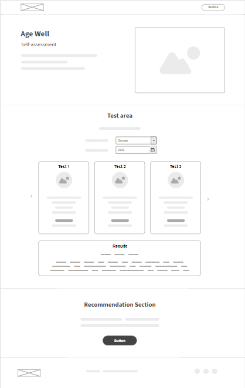

#### Tablets

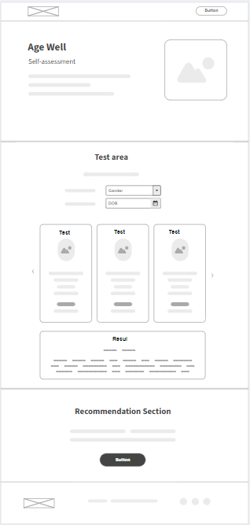

#### Mobile devices
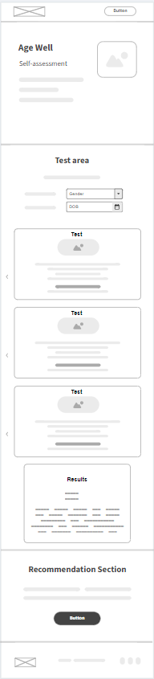

## Testing

Please refer to [Testing](TESTING.md) for all testing-related documentation.

## Deployment

### Deployment to GitHub Pages

- The site was deployed to GitHub pages. The steps to deploy are as follows: 
  - In the [GitHub repository](https://peteig.github.io/AgeWell/), navigate to the Settings tab
  - Select 'pages' in the right hand sidebar 
  - From the source section drop-down menu, select the **Main** Branch, then click "Save".
  - The page will be automatically refreshed with a detailed ribbon display to indicate the successful deployment.

The live link can be found [here](https://peteig.github.io/AgeWell/)

### Local Deployment

In order to make a local copy of this project, you can clone it.
In your IDE Terminal, type the following command:

- `git clone https://peteig.github.io/AgeWell/.git`

- If you use Gitpod, you can [click here](https://gitpod.io/#https://peteig.github.io/AgeWell/), which will start the Gitpod workspace for you.

---

### Credits
In creating this website I relied heavily upon: 
- The requirements and research of my own company [Agile Kinetic](https://www.agilekinetic.com/)
- For frailty assessment thresholds I relied upon the British Geriatrics Society (BGS) https://www.bgs.org.uk/ 
- Documentation at https://getbootstrap.com/
- Images from [Undraw](https://undraw.co/)
- Troubleshooting at https://stackoverflow.com/
- Troubleshooting at https://www.w3.org 
- Troubleshooting at https://www.w3schools.com 
- For the Mockup generator on various screen sizes I used https://techsini.com/multi-mockup/index.php 
- [Responsive Viewer](https://chromewebstore.google.com/detail/responsive-viewer/inmopeiepgfljkpkidclfgbgbmfcennb) Chrome extension was used to visualise pages on various screen sizes
- [GoFullPage](https://chromewebstore.google.com/detail/gofullpage-full-page-scre/fdpohaocaechififmbbbbbknoalclacl) Chrome extension was used to capture full page screenshots of pages

---

### Acknowledgments
  
- [Code Institute](https://codeinstitute.net/) tutors and Slack community members for their support and help
- [Iuliia Konovalova](https://github.com/IuliiaKonovalova): My CI mentor for her advice, encouragement and support
- [GitHub](https://github.com/): Has made it possible to store the code
- [GitHub Pages](https://pages.github.com/) Have made it possible to host and deploy the site directly from my GitHub repository

---

