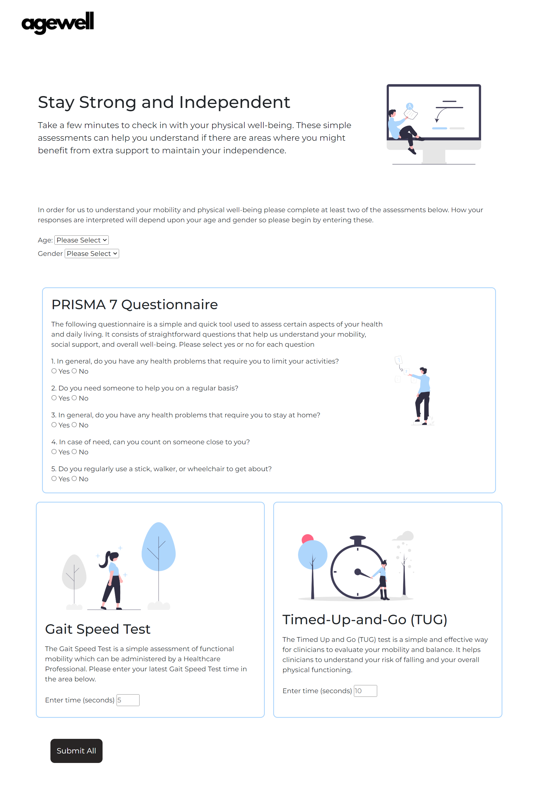
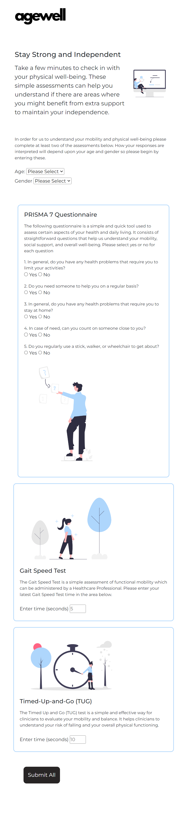
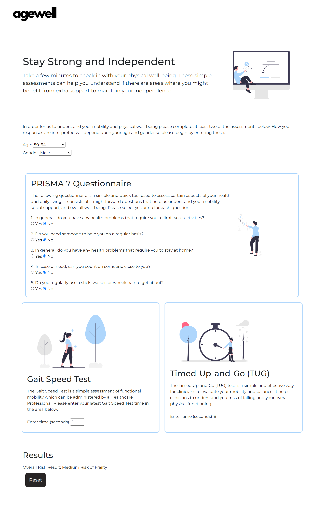
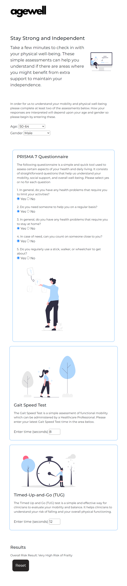
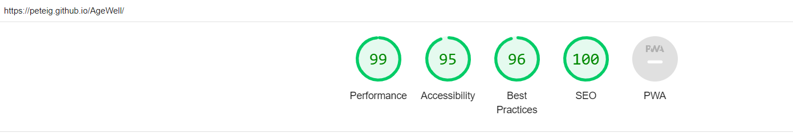

# TESTING
## Compatibility
In order to confirm the correct functionality, responsiveness, and appearance:

The AgeWell website was tested on the following browsers: Chrome, Firefox, Edge, and Safari.

Prior to submission of responses

Post response submission

## Responsiveness
The website was checked using DevTools across various devices and screen sizes.
docs/all_devices.png

---

## User Stories
* As an ageing adult, I want to assess my frailty risk, so that I can take proactive steps to maintain my independence.
- Met by: Clear instructions and validated assessments available on the homepage.
* As a healthcare professional, I want to understand the frailty risk of my patients quickly, so that I can provide appropriate support and resources.
- Met by: Concise risk evaluation and results section that summarises the frailty risk based on assessments.
* As a caregiver, I want to know if my loved one is at risk of frailty, so that I can ensure they get the help they need.
- Met by: User-friendly interface with clear results and recommendations after completing the assessments.

---

## Manual Testing

| feature            | action                                                    | expected result                                                                                   | tested | passed | comments                                               |
| ------------------ | --------------------------------------------------------- | ------------------------------------------------------------------------------------------------- | ------ | ------ | ------------------------------------------------------ |
| Navbar             |                                                           |                                                                                                   |        |        |                                                        |
| Logo               | Click on the Logo                                         | The page is refreshed                                                                             | Yes    | Yes    |                                                        |
| Home page          |                                                           |                                                                                                   |        |        |                                                        |
| Submit             | Click on the "Submit All" button with validated inputs    | The user receives risk evaluation based on inputs                                                 | Yes    | Yes    |                                                        |
| Submit             | Click on the "Submit All" button without validated inputs | A modal is displayed to the user alerting them of invalid inputs                                  | Yes    | Yes    |                                                        |
| Age range input    | Select the age range                                      | The age range is selected                                                                         | Yes    | Yes    | If user doesn't select age, the error modal appears    |
| Gender input       | Select the gender                                         | The gender is selected                                                                            | Yes    | Yes    | If user doesn't select gender, the error modal appears |
| PRISMA input       | Answer the PRISMA questions                               | The answers are recorded                                                                          | Yes    | Yes    | \-                                                     |
| Gait Speed input   | Answer the Gait Speed questions                           | The answers are recorded                                                                          | Yes    | Yes    | \-                                                     |
| TUG input          | Answer the TUG questions                                  | The answers are recorded                                                                          | Yes    | Yes    | \-                                                     |
| "Submit" button    | Click on the "Submit" button                              | The user is redirected to the results section if at least two validated assessments are completed | Yes    | Yes    | \-                                                     |
| Results page       |                                                           |                                                                                                   |        |        |                                                        |
| Overall result     | View the overall risk result                              | The overall risk result is displayed                                                              | Yes    | Yes    | \-                                                     |
| Hide Submit        | The submit button is hidden                               | The submit button is hidden                                                                       | Yes    | Yes    | \-                                                     |
| Reset button shown | The reset button is shown                                 | The reset button is shown                                                                         | Yes    | Yes    | \-                                                     |
| Reset button       | Reset button resets fields                                | Reset button resets fields                                                                        | Yes    | Yes    | \-                                                     |
| Reset button       | Reset button returns user to top of page                  | Reset button returns user to top of page                                                          | Yes    | Yes    | \-                                                     |

---

## Automated Testing
### Jest Testing
Automated tests were conducted using Jest to ensure the correctness of JavaScript functions and user interactions.

#### Input Validation Tests
- Gait Speed Input Validation: Ensured only valid numerical input is accepted.
- TUG Input Validation: Ensured only valid numerical input is accepted.
- Age and Gender Validation: Ensured selections are made.

#### Risk Calculation Tests
- PRISMA Score Calculation: Validated the logic for PRISMA score calculation based on user inputs.
- Gait Speed and TUG Risk Assessment: Tested the risk assessment logic for Gait Speed and TUG.

---

## Validator Testing
### HTML
#### Homepage
Passing through the official W3C validator.
Home Page HTML Validator

#### Assessments Page
Passing through the official W3C validator.

#### Results Page
Passing through the official W3C validator.

### CSS
Passing through the official W3C (Jigsaw) validator.
CSS Validator

### Lighthouse Report
Using Lighthouse in DevTools, it was very high performing on all measures

---

## Bugs
### Solved Bugs
* Issue: The submit button would not work if the user did not complete all required fields.
- Resolved: Added alerts to notify the user if they did not enter valid inputs

* Issue: The volume of alerts did not make for a good user experience if several inputs had not been validated.
- Resolved: Added a modal that alerts the user to fill in all required fields before submission and removed seperate alerts.

* Issue: The user needed a reset button if they wanted to complete the assessments again. The button required all inputs to be reset, hidden areas to be shown, visible areas to again be hidden. 
- Resolved: There appeared to be no reason not to simplify the code by reloading the page and sending the user back to the top of the page. This is the solution which was implemented.

* Issue: The Gait Speed and TUG input fields were accepting non-numeric values.
- Resolved: Implemented input validation and min and max values to ensure only numeric values are accepted.

### Unsolved Bugs
- Our 'Solved Bugs' solution to simplify the code by reloading the page and sending the user back to the top of the page is not technically best practice and is an area for improvement.
- There are no other  known unsolved bugs.

---

This document provides a comprehensive overview of the testing procedures and results for the AgeWell website, ensuring a robust and user-friendly experience. Add screenshots or GIFs where appropriate to visually demonstrate the testing outcomes.